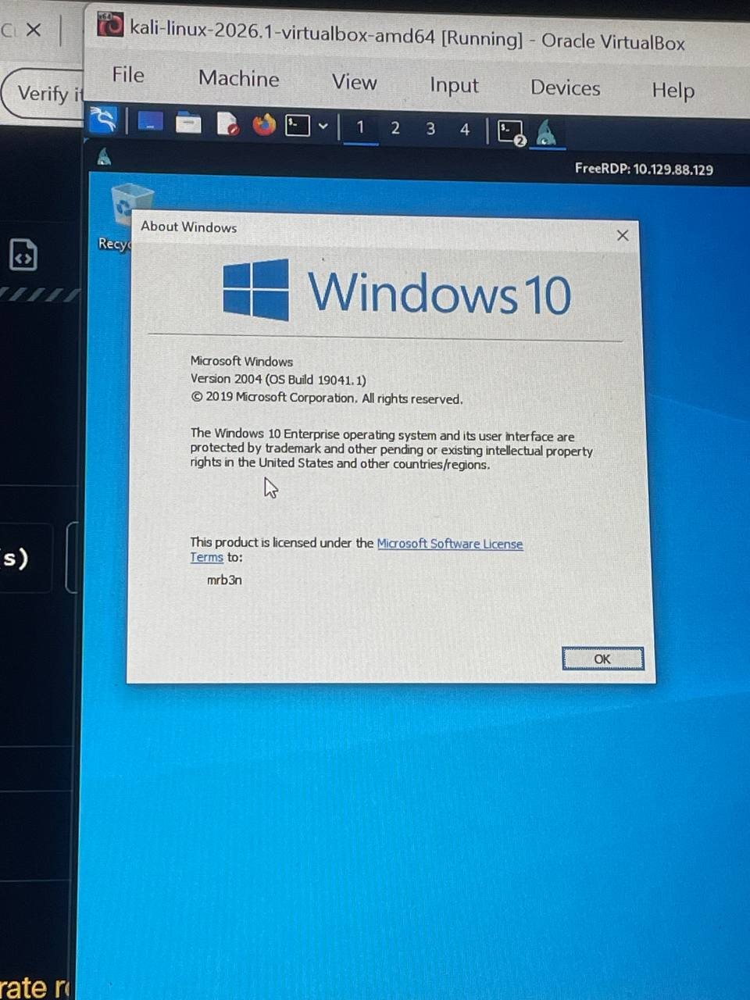
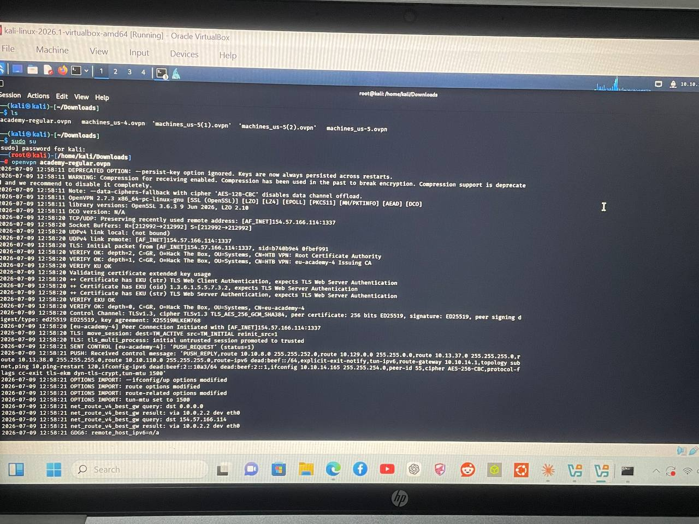
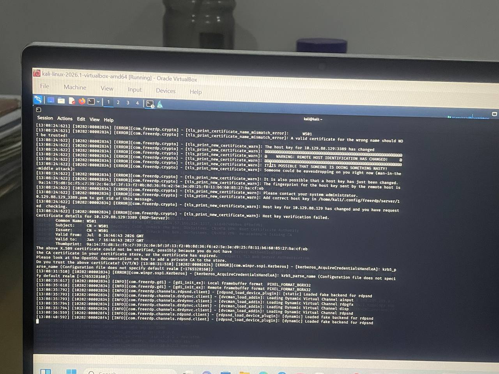
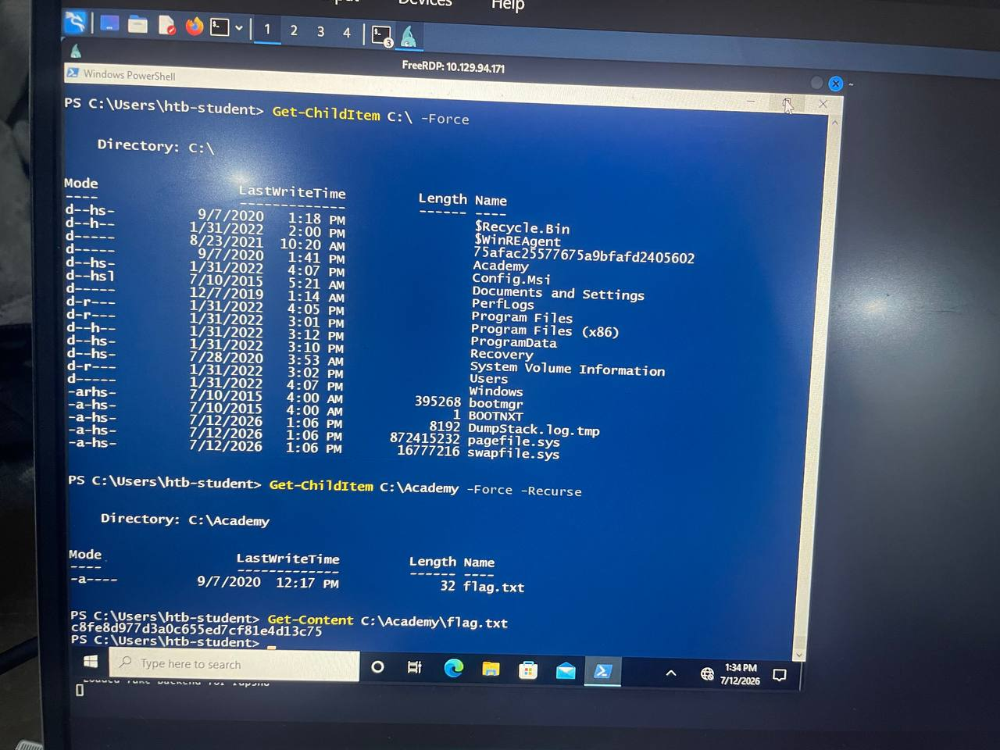

# 📌 Finding a Non-Standard Directory on a Windows Target

## 🧾 Short Description
Located a manually-added, non-standard folder on a Windows 10 target's C:\ drive via RDP, and retrieved a flag file inside it — working through two dead-end guesses and a mid-session VPN/target reset along the way.

---

## ❗ Problem Statement
Find the non-standard directory on the target's C:\ drive and submit the contents of a flag file located inside it. A "non-standard" directory is one that doesn't belong to the normal Windows folder set (Program Files, Windows, Users, ProgramData, etc.) — usually something manually added.

---

## 🖥️ Environment
- **OS/Platform:** Windows 10 Enterprise, Version 2004 (OS Build 19041.1)
- **Environment type:** HTB Academy lab target (ACADEMY-MISC-WS01)
- **Attacking machine:** Kali Linux, connected via HTB Academy VPN



---

## 🛠️ Tools Used
- xfreerdp (RDP client on Kali)
- Windows PowerShell (on target)
- Windows cmd
- OpenVPN (academy-regular.ovpn)

---

## 🧠 Skills Demonstrated
- Windows file system navigation (cmd & PowerShell)
- RDP remote access
- VPN troubleshooting/reconnection
- Systematic investigation under changing conditions

---

## 🪜 Steps Performed
1. Connected to HTB Academy VPN and RDP'd into the Windows target using xfreerdp.
2. Ran `dir c:\ /a` to list the root of C:\ and scan for anything unusual.
3. Investigated two candidate folders that turned out to be dead ends (details below).
4. VPN connection dropped mid-session — reconnected VPN and RDP.

   

5. On reconnecting via RDP, received a host key verification warning — the target had respawned with a new IP, so its RDP certificate no longer matched what Kali had cached.

   

6. Accepted the new host key and ran a fresh `Get-ChildItem C:\ -Force` — this time a folder named `Academy` appeared that hadn't been there in the original session.
7. Listed its contents and read the flag file.

   

---

## 💻 Commands Used

```powershell
# Reconnect VPN (Kali terminal)
cd Downloads
sudo su
openvpn academy-regular.ovpn

# Connect RDP to target
xfreerdp /v:<target-IP> /u:htb-student /p:'Academy_WinFun!'

# List root of C:\ including hidden files
dir c:\ /a                          # cmd
Get-ChildItem C:\ -Force            # PowerShell

# List a folder and subfolders
dir c:\FolderName /s /b                        # cmd
Get-ChildItem C:\FolderName -Force -Recurse    # PowerShell

# Search whole drive for files starting with "flag"
dir c:\flag*.* /s /a       # cmd
where /r c:\ flag*          # cmd, faster recursive search

# Read a text file
Get-Content C:\Path\filename.txt   # PowerShell
type C:\Path\filename.txt          # cmd
```

---

## 🔍 Troubleshooting Process
Started with `dir c:\ /a` to scan the root drive. Two folders looked like candidates:

- **KMPlayer** — a third-party media player sitting loose in C:\ instead of inside Program Files. Fully searched with `dir c:\KMPlayer /s /b` — everything inside was legitimate app files (dlls, exe, skins). Dead end.
- **Intel** — looked out of place for a VM. Checked with `dir c:\Intel /a` and `/s /a`, found `GfxCPLBatchFiles` and `IntelOptaneData` subfolders — no flag. Dead end.

Also ran a broad drive-wide search for anything named "flag" (`dir c:\flag*.* /s /a` and `where /r c:\ flag*`) — only turned up unrelated Microsoft Office/OneDrive assets (flag.html, flag.js, flag icons). Confirmed irrelevant.

Session then dropped due to VPN timeout. After reconnecting VPN and RDP, hit a host key verification warning — a sign the target machine had respawned with a new identity. Accepted the new key, ran a fresh directory listing, and this time a folder called `Academy` was visible that hadn't existed in the previous session.

---

## 🎯 Root Cause
The original target session didn't yet contain the flag folder — it appeared only after the HTB Academy target respawned mid-session (new IP, refreshed file layout). My first two guesses (KMPlayer, Intel) were legitimate system/app folders, not the intended non-standard directory.

---

## ✅ Resolution
After the target respawned, `Get-ChildItem C:\ -Force` revealed a genuinely non-standard folder: `C:\Academy`. Inside it was a single file, `flag.txt`. Read with `Get-Content C:\Academy\flag.txt`, returning:

Submitted as the answer.

---

## 📚 Lessons Learned
HTB Academy targets can respawn with a new IP and a slightly different file layout during a session — especially after being away for a while or if the VPN drops. If a folder found earlier suddenly "doesn't exist," it's worth re-running a full listing of C:\ rather than assuming something is broken — the target itself may have reset. A host key verification warning on RDP reconnect is a useful visual sign this has happened.

---

## 🔮 Future Improvements
Next time, run a full `Get-ChildItem C:\ -Force` sweep immediately after any VPN/RDP reconnect, before re-investigating old leads — would have caught the target respawn sooner.

---

## 📊 Status
- [x] Complete
